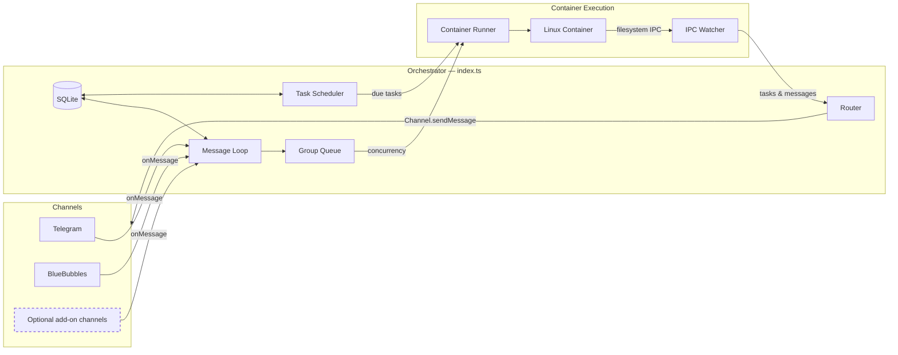

# Archived NanoClaw Specification (Non-Normative)

> **ARCHIVED DESIGN RECORD — DO NOT USE AS CURRENT OPERATING, SECURITY, OR
> RELEASE INSTRUCTIONS.** This document preserves the upstream NanoClaw design
> for historical context. Its code samples, paths, commands, interfaces, channel
> lists, and authority descriptions may no longer execute or be safe. Current
> truth lives in the root README, [ADMIN_GUIDE.md](ADMIN_GUIDE.md),
> [SETUP_AND_FEATURES_GUIDE.md](SETUP_AND_FEATURES_GUIDE.md),
> [SECURITY.md](SECURITY.md), and live status commands. Current ordinary chat is
> tool-free; other routes receive exact capability and MCP allowlists; trusted
> controls are read-only; and no host `.env`, Codex home, auth, or configuration
> is mounted or copied into an agent container.

A personal Claude assistant with multi-channel support, persistent memory per conversation, scheduled tasks, and container-isolated agent execution.

---

## Table of Contents

1. [Architecture](#architecture)
2. [Architecture: Channel System](#architecture-channel-system)
3. [Folder Structure](#folder-structure)
4. [Configuration](#configuration)
5. [Memory System](#memory-system)
6. [Session Management](#session-management)
7. [Message Flow](#message-flow)
8. [Commands](#commands)
9. [Scheduled Tasks](#scheduled-tasks)
10. [MCP Servers](#mcp-servers)
11. [Deployment](#deployment)
12. [Security Considerations](#security-considerations)

---

## Architecture

```
┌──────────────────────────────────────────────────────────────────────┐
│                        HOST (macOS / Linux)                           │
│                     (Main Node.js Process)                            │
├──────────────────────────────────────────────────────────────────────┤
│                                                                       │
│  ┌──────────────────┐                  ┌────────────────────┐        │
│  │ Channels         │─────────────────▶│   SQLite Database  │        │
│  │ (self-register   │◀────────────────│   (messages.db)    │        │
│  │  at startup)     │  store/send      └─────────┬──────────┘        │
│  └──────────────────┘                            │                   │
│                                                   │                   │
│         ┌─────────────────────────────────────────┘                   │
│         │                                                             │
│         ▼                                                             │
│  ┌──────────────────┐    ┌──────────────────┐    ┌───────────────┐   │
│  │  Message Loop    │    │  Scheduler Loop  │    │  IPC Watcher  │   │
│  │  (polls SQLite)  │    │  (checks tasks)  │    │  (file-based) │   │
│  └────────┬─────────┘    └────────┬─────────┘    └───────────────┘   │
│           │                       │                                   │
│           └───────────┬───────────┘                                   │
│                       │ spawns container                              │
│                       ▼                                               │
├──────────────────────────────────────────────────────────────────────┤
│                     CONTAINER (Linux VM)                               │
├──────────────────────────────────────────────────────────────────────┤
│  ┌──────────────────────────────────────────────────────────────┐    │
│  │                    AGENT RUNNER                               │    │
│  │                                                                │    │
│  │  Working directory: /workspace/group (mounted from host)       │    │
│  │  Volume mounts:                                                │    │
│  │    • groups/{name}/ → /workspace/group                         │    │
│  │    • groups/global/ → /workspace/global/ (non-main only)       │    │
│  │    • scoped route session state → /home/node/.claude/          │    │
│  │    • trusted settings/skills/plugins → read-only overlays      │    │
│  │    • Additional dirs → /workspace/extra/*                      │    │
│  │                                                                │    │
│  │  Tools (route-specific):                                       │    │
│  │    • direct assistant: none                                    │    │
│  │    • protected/control: exact read/web or MCP allowlists       │    │
│  │    • advanced/code: explicit engineering tools, no MCP while   │    │
│  │      shell-capable                                             │    │
│  │                                                                │    │
│  └──────────────────────────────────────────────────────────────┘    │
│                                                                       │
└───────────────────────────────────────────────────────────────────────┘
```

### Technology Stack

| Component          | Technology                                    | Purpose                                           |
| ------------------ | --------------------------------------------- | ------------------------------------------------- |
| Channel System     | Channel registry (`src/channels/registry.ts`) | Channels self-register at startup                 |
| Message Storage    | SQLite (better-sqlite3)                       | Store messages for polling                        |
| Container Runtime  | Containers (Linux VMs)                        | Isolated environments for agent execution         |
| Agent              | @anthropic-ai/claude-agent-sdk (0.2.29)       | Run Claude with tools and MCP servers             |
| Browser Automation | agent-browser + Chromium                      | Web interaction and screenshots                   |
| Runtime            | Node.js 22.22.2                               | Validated host process for routing and scheduling |

---

## Architecture: Channel System

The current Andrea fork ships Telegram and BlueBubbles as built-in channel
implementations. Other channel integrations remain optional transformations or
add-ons and are not baseline product claims. Enabled channels self-register at
startup; an installed channel with missing credentials is skipped with bounded
health evidence.

### System Diagram



### Channel Registry

The channel system is built on a factory registry in `src/channels/registry.ts`:

```typescript
export type ChannelFactory = (opts: ChannelOpts) => Channel | null;

const registry = new Map<string, ChannelFactory>();

export function registerChannel(name: string, factory: ChannelFactory): void {
  registry.set(name, factory);
}

export function getChannelFactory(name: string): ChannelFactory | undefined {
  return registry.get(name);
}

export function getRegisteredChannelNames(): string[] {
  return [...registry.keys()];
}
```

Each factory receives `ChannelOpts` (callbacks for `onMessage`, `onChatMetadata`, and `registeredGroups`) and returns either a `Channel` instance or `null` if that channel's credentials are not configured.

### Channel Interface

Do not copy an interface from this archive. The authoritative `Channel`, send
receipt, artifact, health, typing, group-sync, and bounded-history contracts are
in [src/types.ts](../src/types.ts). Review all current callers and tests before
changing that interface.

### Self-Registration Pattern

Channels self-register using a barrel-import pattern:

1. Each channel skill adds a file to `src/channels/` (e.g. `whatsapp.ts`, `telegram.ts`) that calls `registerChannel()` at module load time:

   ```typescript
   // src/channels/whatsapp.ts
   import { registerChannel, ChannelOpts } from './registry.js';

   export class WhatsAppChannel implements Channel {
     /* ... */
   }

   registerChannel('whatsapp', (opts: ChannelOpts) => {
     // Return null if credentials are missing
     if (!existsSync(authPath)) return null;
     return new WhatsAppChannel(opts);
   });
   ```

2. The barrel file `src/channels/index.ts` imports all channel modules, triggering registration:

   ```typescript
   import './whatsapp.js';
   import './telegram.js';
   // ... each skill adds its import here
   ```

3. At startup, the orchestrator (`src/index.ts`) loops through registered channels and connects whichever ones return a valid instance:

   ```typescript
   for (const name of getRegisteredChannelNames()) {
     const factory = getChannelFactory(name);
     const channel = factory?.(channelOpts);
     if (channel) {
       await channel.connect();
       channels.push(channel);
     }
   }
   ```

### Key Files

| File                       | Purpose                                                 |
| -------------------------- | ------------------------------------------------------- |
| `src/channels/registry.ts` | Channel factory registry                                |
| `src/channels/index.ts`    | Barrel imports that trigger channel self-registration   |
| `src/types.ts`             | `Channel` interface, `ChannelOpts`, message types       |
| `src/index.ts`             | Orchestrator — instantiates channels, runs message loop |
| `src/router.ts`            | Finds the owning channel for a JID, formats messages    |

### Adding a New Channel

To add a new channel, contribute a skill to `.claude/skills/add-<name>/` that:

1. Adds a `src/channels/<name>.ts` file implementing the `Channel` interface
2. Calls `registerChannel(name, factory)` at module load
3. Returns `null` from the factory if credentials are missing
4. Adds an import line to `src/channels/index.ts`

See existing skills (`/add-whatsapp`, `/add-telegram`, `/add-slack`, `/add-discord`, `/add-gmail`) for the pattern.

---

## Folder Structure

```
nanoclaw/
├── CLAUDE.md                      # Project context for Claude Code
├── docs/
│   ├── SPEC.md                    # This specification document
│   ├── REQUIREMENTS.md            # Architecture decisions
│   └── SECURITY.md                # Security model
├── README.md                      # User documentation
├── package.json                   # Node.js dependencies
├── tsconfig.json                  # TypeScript configuration
├── .mcp.json                      # MCP server configuration (reference)
├── .gitignore
│
├── src/
│   ├── index.ts                   # Orchestrator: state, message loop, agent invocation
│   ├── channels/
│   │   ├── registry.ts            # Channel factory registry
│   │   └── index.ts               # Barrel imports for channel self-registration
│   ├── ipc.ts                     # IPC watcher and task processing
│   ├── router.ts                  # Message formatting and outbound routing
│   ├── config.ts                  # Configuration constants
│   ├── types.ts                   # TypeScript interfaces (includes Channel)
│   ├── logger.ts                  # Pino logger setup
│   ├── db.ts                      # SQLite database initialization and queries
│   ├── group-queue.ts             # Per-group queue with global concurrency limit
│   ├── mount-security.ts          # Mount allowlist validation for containers
│   ├── whatsapp-auth.ts           # Standalone WhatsApp authentication
│   ├── task-scheduler.ts          # Runs scheduled tasks when due
│   └── container-runner.ts        # Spawns agents in containers
│
├── container/
│   ├── Dockerfile                 # Container image (runs as 'node' user, includes Claude Code CLI)
│   ├── build.sh                   # Build script for container image
│   ├── agent-runner/              # Code that runs inside the container
│   │   ├── package.json
│   │   ├── tsconfig.json
│   │   └── src/
│   │       ├── index.ts           # Entry point (query loop, IPC polling, session resume)
│   │       └── ipc-mcp-stdio.ts   # Stdio-based MCP server for host communication
│   └── skills/
│       └── agent-browser.md       # Browser automation skill
│
├── dist/                          # Compiled JavaScript (gitignored)
│
├── .claude/
│   └── skills/
│       ├── setup/SKILL.md              # /setup - First-time installation
│       ├── customize/SKILL.md          # /customize - Add capabilities
│       ├── debug/SKILL.md              # /debug - Container debugging
│       ├── add-telegram/SKILL.md       # /add-telegram - Telegram channel
│       ├── add-gmail/SKILL.md          # /add-gmail - Gmail integration
│       ├── add-voice-transcription/    # /add-voice-transcription - Whisper
│       ├── x-integration/SKILL.md      # /x-integration - X/Twitter
│       ├── convert-to-apple-container/  # Retired unsupported compatibility stub
│       └── add-parallel/SKILL.md       # /add-parallel - Parallel agents
│
├── groups/
│   ├── CLAUDE.md                  # Global memory (all groups read this)
│   ├── {channel}_main/             # Main control channel (e.g., whatsapp_main/)
│   │   ├── CLAUDE.md              # Main channel memory
│   │   └── logs/                  # Task execution logs
│   └── {channel}_{group-name}/    # Per-group folders (created on registration)
│       ├── CLAUDE.md              # Group-specific memory
│       ├── logs/                  # Task logs for this group
│       └── *.md                   # Files created by the agent
│
├── store/                         # Local data (gitignored)
│   ├── auth/                      # WhatsApp authentication state
│   └── messages.db                # SQLite database (messages, chats, scheduled_tasks, task_run_logs, registered_groups, sessions, router_state)
│
├── data/                          # Application state (gitignored)
│   ├── sessions/                  # Per-group session data (.claude/ dirs with JSONL transcripts)
│   └── ipc/                       # Container IPC (messages/, tasks/)
│
├── logs/                          # Runtime logs (gitignored)
│   ├── nanoclaw.log               # Host stdout
│   └── nanoclaw.error.log         # Host stderr
│   # Note: Per-container logs are in groups/{folder}/logs/container-*.log
│
└── launchd/
    └── com.nanoclaw.plist         # macOS service configuration
```

---

## Configuration

Configuration constants are in `src/config.ts`:

```typescript
import path from 'path';

export const ASSISTANT_NAME = process.env.ASSISTANT_NAME || 'Andrea';
export const POLL_INTERVAL = 2000;
export const SCHEDULER_POLL_INTERVAL = 60000;

// Paths are absolute (required for container mounts)
const PROJECT_ROOT = process.cwd();
export const STORE_DIR = path.resolve(PROJECT_ROOT, 'store');
export const GROUPS_DIR = path.resolve(PROJECT_ROOT, 'groups');
export const DATA_DIR = path.resolve(PROJECT_ROOT, 'data');

// Container configuration
export const CONTAINER_IMAGE =
  process.env.CONTAINER_IMAGE || 'nanoclaw-agent:latest';
export const CONTAINER_TIMEOUT = parseInt(
  process.env.CONTAINER_TIMEOUT || '1800000',
  10,
); // 30min default
export const IPC_POLL_INTERVAL = 1000;
export const IDLE_TIMEOUT = parseInt(process.env.IDLE_TIMEOUT || '300000', 10); // 5min — keep container alive after last result (clamped below hard timeout)
export const MAX_CONCURRENT_CONTAINERS = Math.max(
  1,
  parseInt(process.env.MAX_CONCURRENT_CONTAINERS || '5', 10) || 5,
);

export const TRIGGER_PATTERN = new RegExp(`^@${ASSISTANT_NAME}\\b`, 'i');
```

**Note:** Paths must be absolute for container volume mounts to work correctly.

### Container Configuration

Groups can have additional directories mounted via `containerConfig` in the SQLite `registered_groups` table (stored as JSON in the `container_config` column). Example registration:

```typescript
setRegisteredGroup('1234567890@g.us', {
  name: 'Dev Team',
  folder: 'whatsapp_dev-team',
  trigger: '@Andrea',
  added_at: new Date().toISOString(),
  containerConfig: {
    additionalMounts: [
      {
        hostPath: '~/projects/webapp',
        containerPath: 'webapp',
        readonly: false,
      },
    ],
    timeout: 600000,
  },
});
```

Folder names follow the convention `{channel}_{group-name}` (e.g., `whatsapp_family-chat`, `telegram_dev-team`). The main group has `isMain: true` set during registration.

Additional mounts appear at `/workspace/extra/{containerPath}` inside the container.

**Mount syntax note:** Read-write mounts use `-v host:container`, but readonly mounts require `--mount "type=bind,source=...,target=...,readonly"` (the `:ro` suffix may not work on all runtimes).

In current Andrea, this archived example is not authority to attach a directory.
Ordinary direct-assistant turns receive no additional directories. Any eligible
execution route must pass the canonical path/symlink allowlist and route policy;
a runtime that cannot enforce required read-only mounts fails closed.

### Claude Authentication

OneCLI Agent Vault is the preferred credential boundary. If OneCLI is
unavailable, the runtime may select one credential from the host environment or
project `.env` as an explicitly degraded fallback.

**Option 1: Claude Subscription (OAuth token)**

```bash
CLAUDE_CODE_OAUTH_TOKEN=sk-ant-oat01-...
```

Provision the token through a trusted operator surface outside the assistant
conversation. Do not read a host credential profile into agent context.

**Option 2: Pay-per-use API Key**

```bash
ANTHROPIC_API_KEY=sk-ant-api03-...
```

No `.env` copy is written or mounted into the container. In degraded fallback
mode, the selected secret value travels only in the spawned runtime process
environment and the container arguments carry a bare `-e KEY`. Secret values
must remain absent from command arguments, process listings, mounted files,
logs, errors, and diagnostics.

### Changing the Assistant Name

Set the `ASSISTANT_NAME` environment variable:

```bash
ASSISTANT_NAME=Bot npm start
```

Or edit the default in `src/config.ts`. This changes:

- The trigger pattern (messages must start with `@YourName`)
- The response prefix (`YourName:` added automatically)

### Placeholder Values in launchd

Files with `{{PLACEHOLDER}}` values need to be configured:

- `{{PROJECT_ROOT}}` - Absolute path to your nanoclaw installation
- `{{NODE_PATH}}` - Path to node binary (detected via `which node`)
- `{{HOME}}` - User's home directory

---

## Memory System

NanoClaw uses a hierarchical memory system based on CLAUDE.md files.

### Memory Hierarchy

| Level      | Location                  | Read By    | Written By | Purpose                                                     |
| ---------- | ------------------------- | ---------- | ---------- | ----------------------------------------------------------- |
| **Global** | `groups/CLAUDE.md`        | All groups | Main only  | Preferences, facts, context shared across all conversations |
| **Group**  | `groups/{name}/CLAUDE.md` | That group | That group | Group-specific context, conversation memory                 |
| **Files**  | `groups/{name}/*.md`      | That group | That group | Notes, research, documents created during conversation      |

### How Memory Works

1. **Context Loading**
   - Transcript/session state is separated by capability lane.
   - Direct-assistant, protected, and control routes receive host-constant
     guidance; only the execution lane may consume mutable group `CLAUDE.md`.
   - Project settings and hooks are ignored. Canonical runner source, settings,
     enabled skills, plugins, and IPC controls are trusted read-only views.

2. **Writing Memory**
   - Current personal learning uses structured, provenance-aware stores and
     approval/forget controls; this archived file hierarchy is not the
     authoritative memory contract.
   - File writes require an explicitly classified execution capability and a
     permitted mount; ordinary chat cannot write files.

3. **Main Channel Privileges**
   - Main-channel identity changes which control requests may be staged; it does
     not bypass route policy or grant tools automatically.
   - External sends, calendar writes, purchases, deployments, deletions, and
     administrative changes continue to require fresh target-bound approval.

---

## Session Management

Sessions enable conversation continuity - Claude remembers what you talked about.

### How Sessions Work

1. Each group has a session ID stored in SQLite (`sessions` table, keyed by `group_folder`)
2. Session ID is passed to Claude Agent SDK's `resume` option
3. Claude continues the conversation with full context
4. Session transcripts are stored as JSONL files in `data/sessions/{group}/.claude/`

---

## Message Flow

### Incoming Message Flow

```
1. User sends a message via any connected channel
   │
   ▼
2. Channel receives message (e.g. Baileys for WhatsApp, Bot API for Telegram)
   │
   ▼
3. Message stored in SQLite (store/messages.db)
   │
   ▼
4. Message loop polls SQLite (every 2 seconds)
   │
   ▼
5. Router checks:
   ├── Is chat_jid in registered groups (SQLite)? → No: ignore
   └── Does message match trigger pattern? → No: store but don't process
   │
   ▼
6. Router catches up conversation:
   ├── Fetch all messages since last agent interaction
   ├── Format with timestamp and sender name
   └── Build prompt with full conversation context
   │
   ▼
7. Router classifies the route before invoking the Agent SDK:
   ├── direct assistant: no built-in tools, MCP, or additional directories
   ├── protected/control: exact read/lookup tools and MCP allowlists only
   ├── advanced/code: explicit execution tools, with no MCP while shell-capable
   └── resume: only session state from the same capability lane
   │
   ▼
8. The runner processes the request:
   ├── uses host-constant guidance outside the execution lane
   ├── may use mutable group guidance only in the execution lane
   └── can call only the SDK tools/MCP servers enforced by that route policy
   │
   ▼
9. Router prefixes response with assistant name and sends via the owning channel
   │
   ▼
10. Router updates last agent timestamp and saves session ID
```

### Trigger Word Matching

Messages must start with the trigger pattern (default: `@Andrea`):

- `@Andrea what's the weather?` → ✅ Triggers Claude
- `@andrea help me` → ✅ Triggers (case insensitive)
- `Hey @Andrea` → ❌ Ignored (trigger not at start)
- `What's up?` → ❌ Ignored (no trigger)

### Conversation Catch-Up

When a triggered message arrives, the agent receives all messages since its last interaction in that chat. Each message is formatted with timestamp and sender name:

```
[Jan 31 2:32 PM] John: hey everyone, should we do pizza tonight?
[Jan 31 2:33 PM] Sarah: sounds good to me
[Jan 31 2:35 PM] John: @Andrea what toppings do you recommend?
```

This allows the agent to understand the conversation context even if it wasn't mentioned in every message.

---

## Commands

### Commands Available in Any Group

| Command                | Example                       | Effect         |
| ---------------------- | ----------------------------- | -------------- |
| `@Assistant [message]` | `@Andrea what's the weather?` | Talk to Claude |

### Commands Available in Main Channel Only

| Command                          | Example                               | Effect                 |
| -------------------------------- | ------------------------------------- | ---------------------- |
| `@Assistant add group "Name"`    | `@Andrea add group "Family Chat"`     | Register a new group   |
| `@Assistant remove group "Name"` | `@Andrea remove group "Work Team"`    | Unregister a group     |
| `@Assistant list groups`         | `@Andrea list groups`                 | Show registered groups |
| `@Assistant remember [fact]`     | `@Andrea remember I prefer dark mode` | Add to global memory   |

---

## Scheduled Tasks

Andrea has a built-in scheduler, but a scheduled task does not inherit an
unbounded "full agent" capability.

### How Scheduling Works

1. **Group Context**: Tasks created in a group run with that group's working directory and memory
2. **Policy-Scoped Capabilities**: Each run receives only the tools, mounts, and
   MCP servers permitted by its classified route and stored policy
3. **Approval-Bound Effects**: A schedule may prepare local output, but external
   messages, calendar writes, purchases, deployments, deletions, and other
   sensitive effects still require current policy checks and fresh approval
4. **Main Channel Privileges**: The main channel can schedule tasks for any group and view all tasks

### Schedule Types

| Type       | Value Format    | Example                      |
| ---------- | --------------- | ---------------------------- |
| `cron`     | Cron expression | `0 9 * * 1` (Mondays at 9am) |
| `interval` | Milliseconds    | `3600000` (every hour)       |
| `once`     | ISO timestamp   | `2024-12-25T09:00:00Z`       |

### Creating a Task

```
User: @Andrea remind me every Monday at 9am to review the weekly metrics

Claude: [calls mcp__nanoclaw__schedule_task]
        {
          "prompt": "Send a reminder to review weekly metrics. Be encouraging!",
          "schedule_type": "cron",
          "schedule_value": "0 9 * * 1"
        }

Claude: Done! I'll remind you every Monday at 9am.
```

### One-Time Tasks

```
User: @Andrea at 5pm today, send me a summary of today's emails

Claude: [calls mcp__nanoclaw__schedule_task]
        {
          "prompt": "Search for today's emails, summarize the important ones, and send the summary to the group.",
          "schedule_type": "once",
          "schedule_value": "2024-01-31T17:00:00Z"
        }
```

### Managing Tasks

From any group:

- `@Andrea list my scheduled tasks` - View tasks for this group
- `@Andrea pause task [id]` - Pause a task
- `@Andrea resume task [id]` - Resume a paused task
- `@Andrea cancel task [id]` - Delete a task

From main channel:

- `@Andrea list all tasks` - View tasks from all groups
- `@Andrea schedule task for "Family Chat": [prompt]` - Schedule for another group

---

## MCP Servers

### NanoClaw MCP (route-scoped)

The MCP server is not available to every call. Direct-assistant turns receive
no MCP server. Protected/control routes receive only their exact allowlist, and
shell-capable execution routes do not receive MCP concurrently. The tools below
are potential operations when the selected route and policy permit them; their
presence here is not an authority grant.

**Available Tools:**
| Tool | Purpose |
|------|---------|
| `schedule_task` | Schedule a recurring or one-time task |
| `list_tasks` | Show tasks (group's tasks, or all if main) |
| `get_task` | Get task details and run history |
| `update_task` | Modify task prompt or schedule |
| `pause_task` | Pause a task |
| `resume_task` | Resume a paused task |
| `cancel_task` | Delete a task |
| `send_message` | Send a message to the group via its channel |

---

## Deployment

NanoClaw runs as a single macOS launchd service.

### Startup Sequence

When NanoClaw starts, it:

1. **Ensures container runtime is running** - Automatically starts it if needed; kills orphaned NanoClaw containers from previous runs
2. Initializes the SQLite database (migrates from JSON files if they exist)
3. Loads state from SQLite (registered groups, sessions, router state)
4. **Connects channels** — loops through registered channels, instantiates those with credentials, calls `connect()` on each
5. Once at least one channel is connected:
   - Starts the scheduler loop
   - Starts the IPC watcher for container messages
   - Sets up the per-group queue with `processGroupMessages`
   - Recovers any unprocessed messages from before shutdown
   - Starts the message polling loop

### Managing the Service

Do not copy or hand-edit the archived plist template. Use the canonical service
wrapper so paths, Node selection, provenance, and health checks stay aligned:

```bash
npm run mac:services:install
npm run mac:services:start
npm run mac:services:stop
npm run mac:services:restart
npm run mac:services:status
npm run mac:services:logs
```

---

## Security Considerations

### Container Isolation

Agent work runs inside containers, providing:

- **Filesystem isolation**: Agents can only access mounted directories
- **Route-specific command access**: only explicitly classified advanced/code
  routes may receive shell-capable tools
- **Network isolation**: Can be configured per-container if needed
- **Bounded host effects**: Containers are not a claim of zero host impact.
  They can consume CPU, memory, disk, network, and explicitly mounted/IPC
  capabilities; mount policy, route-scoped tools, authenticated IPC, approval
  gates, and postcondition checks bound those effects
- **Non-root user**: Container runs as unprivileged `node` user (uid 1000)

### Prompt Injection Risk

WhatsApp messages could contain malicious instructions attempting to manipulate Claude's behavior.

**Mitigations:**

- Container isolation limits blast radius
- Only registered groups are processed
- Trigger word required (reduces accidental processing)
- Agents can only access their group's mounted directories
- Main can configure additional directories per group
- Claude's built-in safety training

**Recommendations:**

- Only register trusted groups
- Review additional directory mounts carefully
- Review scheduled tasks periodically
- Monitor logs for unusual activity

### Credential Storage

| Credential           | Storage Location                  | Notes                                                                                                   |
| -------------------- | --------------------------------- | ------------------------------------------------------------------------------------------------------- |
| Claude session state | route-specific data/sessions path | Per-group writable transcripts/session continuity; trusted settings and controls are overlaid read-only |
| WhatsApp Session     | store/auth/                       | Auto-created, persists ~20 days                                                                         |

### File Permissions

The groups/ folder contains personal memory and should be protected:

```bash
chmod 700 groups/
```

---

## Troubleshooting

### Common Issues

| Issue                                    | Cause                             | Solution                                                                                                   |
| ---------------------------------------- | --------------------------------- | ---------------------------------------------------------------------------------------------------------- |
| No response to messages                  | Service not running               | Run `npm run mac:services:status`, then inspect the canonical logs                                         |
| "Claude Code process exited with code 1" | Container runtime failed to start | Check logs and the container contract; do not weaken isolation to make the probe pass                      |
| "Claude Code process exited with code 1" | Session/control mount rejected    | Run the canonical container contract and isolated mount canary; do not mount host profiles as a workaround |
| Session not continuing                   | Session ID or lane mismatch       | Use sanitized diagnostics; preserve session data and verify the route-specific session lane                |
| Session not continuing                   | Mount path mismatch               | Container user is `node` with `HOME=/home/node`; use the canonical mount builder                           |
| Channel authentication expired           | Provider session requires renewal | Use that channel's documented reauthorization flow; never delete the whole auth store as a first response  |
| No groups registered                     | Registration is incomplete        | Follow [ADMIN_GUIDE.md](ADMIN_GUIDE.md) registration recovery; do not invent a group from stored messages  |

### Log Location

- `logs/nanoclaw.log` - stdout
- `logs/nanoclaw.error.log` - stderr

### Debug Mode

Run manually for verbose output:

```bash
npm run dev
# or
node dist/index.js
```
